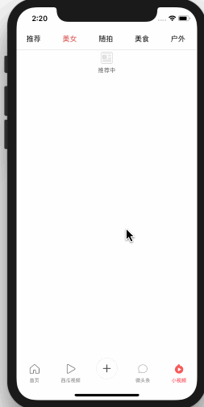
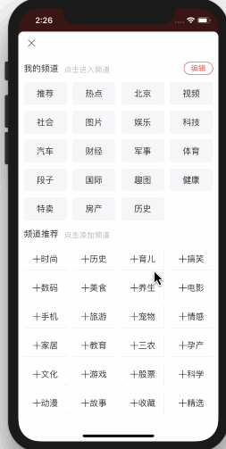

# Swift 4 - 模仿今日头条

 

# 视频链接地址请看 **[腾讯课堂](https://ke.qq.com/course/281908#tuin=1c8f38f4)** ，本系列视频实战教程需要有 Swift 语言基础，并且有过 iOS 开发相关经验。

# 功能截图。

# 项目环境

- Xcode 9.3
- Swift 4.1
- iOS 11

# 最早分支代码请看 [TodayNews-old](https://github.com/hrscy/TodayNews/tree/TodayNews-old)，仅供参考。

# 下面我上传了一些试看内容。

### [101-项目搭建](http://player.youku.com/embed/XMzI1MzI3MTY4OA==)

### [617-正则表达式匹配用户名话题和链接](http://player.youku.com/embed/XMzI1NjI1NjEyNA==)

## 新增接口文档
[接口文档](https://github.com/hrscy/TodayNews/tree/master/news-docs)

接口文档使用的是 [MKDocs](http://www.mkdocs.org/)，具体安装方法以及使用可以参考官网的介绍。

# 实现功能
- [x] 获取今日头条接口（接口获取方式请看 [使用 Charles 获取 https 的数据](https://www.jianshu.com/p/235bc6c3ca77)）
- [x]   首页
- [x]   查看图文详情（点击第一个 cell）
- [x]   保存图片功能
- [x]   添加频道界面
- [x]   问答界面
- [x]   视频界面
- [x]   视频详情界面
- [x]   播放视频功能
- [x]   微头条界面
- [x]  小视频界面
- [x]  播放小视频功能
- [x]  我的界面
- [x]  切换主题功能
- [x]  关注用户详情界面
- [x]  关注和取消关注功能
- [x]  图文混排，显示表情，高亮用户名，话题
- [x]  评论界面
- [x]  点赞列表界面
- [x]  登录界面
- [x]  设置界面
- [x]  离线下载界面

# 视频目录
1. 项目搭建
    - 101-项目搭建
    - 102-补充内容
    - 102-自定义 tabBar
2. 我的界面
    - 201-我的界面分析
    - 202-我的界面实现
    - 203-Swift的核心
    - 204-添加网络请求以及创建模型
    - 205-返回数据显示到 tableView
    - 206-自定义我的界面 cell
    - 207-扩展cell注册方法
    - 208-自定义我的关注 cell
    - 209-自定义关注用户 cell
    - 210-自定义 tableViewHeader
    - 211-更换主题
    - 212-iPhoneX 适配介绍
    - 213-iPhoneX 适配和设置 tabbar 的主题
3. 登录及设置界面
    - 301-登录界面实现
    - 302-登录界面更换主题
    - 303-实现设置界面
    - 304-设置界面添加点击功能
    - 305-修改设置界面代码
4. 离线下载界面
    - 401-离线下载界面
    - 402-集成 sqlite3
    - 403-修改一些变化
    - 404-建表
5. 用户详情界面
    - 501-用户详情界面的分析
    - 502-创建用户详情头部
    - 503-添加相关接口
    - 504-填充数据
    - 505-headerView 的点击事件
    - 506-设置主题颜色
    - 507-添加 topTabView
    - 508-添加 bottomView
    - 509-从xib加载的扩展方法
    - 510-自定义弹出视图
    - 511-自定义导航栏
    - 512-添加相关推荐 view
    - 513-导航栏补充
6. 用户详情动态界面
    - 601-用户详情动态数据显示
    - 602-创建 collectionView
    - 603-动态 cell 分析及创建枚举
    - 604-计算 collectionView 的宽高
    - 605-自定义发布视频或文章view
    - 606-实现引用评论布局
    - 607-Int 扩展
    - 608-动态 cell 显示时间
    - 609-自定义首页导航栏
    - 610-设置微头条及导航栏样式
    - 611-动态界面查看大图
    - 612-添加 item_type
    - 613-修改动态cell的显示问题
    - 614-显示 emoji 表情
    - 615-设置用户名高亮显示
    - 616-自定义 UILabel 显示富文本
    - 617-正则表达式匹配用户名话题和链接
    - 618-实现富文本点击回调
    - 619-根据用户名获取 uid 进行传值
    - 620-根据话题获取 cid 进行传值
    - 621-用户动态添加上拉刷新
    - 622-根据不同类型刷新
    - 623-引用显示@用户名
    - 624-处理其他 topTab 的数据显示
    - 625-添加用户详情中问答的接口
    - 626-自定义用户详情的问答 cell
    - 627-用户详情问答加载更多数据
    - 628-创建动态的详情控制器
    - 629-自定义动态详情导航栏
    - 630-设置导航栏样式
    - 631-自定义动态详情的 headerView
    - 632-计算动态详情头部的高度
    - 633-添加用户动态详情评论的接口
    - 634-自定义动态详情评论cell
    - 639-修改用户详情控制器4
    - 638-创建topTabScrollview
    - 637-修改详情控制器3
    - 636-修改详情控制器2
    - 635-修改详情控制器1
7. 用户详情动态详情界面
    - 701-修改动态详情评论
    - 702-添加点赞用户列表接口
    - 703-添加加载更多数据的footer
    - 704-自定义点赞用户cell
    - 705-cell添加点击事件
    - 706-处理导航栏出现的bug
    - 707-动态详情控制器底部添加toolbar
    - 708-自定义评论的view
    - 709-监听键盘弹起和隐藏
    - 710-textView 的一些设置
    - 711-自定义表情键盘
    - 712-自定义emoji的cell
    - 713-修改表情键盘视图创建方式
    - 714-显示emoji表情
    - 715-设置 collectionView 的布局
    - 716-修改约束
    - 717-修改约束2
    - 718-修改 emoji 数组及 plist 文件
    - 719-设置 item 横向排列
    - 720-解决 collectionView 分页不正确的问题
    - 721-插入表情到 textView
    - 722-表情键盘添加 pageControl
8. 问答界面
    - 801-添加问答接口
    - 802-修改问答控制器
    - 803-自定义头部
    - 804-设置问答底部view
    - 805-自定义问答 cell
    - 806-label添加扩展方法
    - 807-加载更多问答数据
9. 小视频界面
    - 901-添加首页新闻数据和小视频标题数据接口
    - 902-添加导航栏标题
    - 903-创建小视频子控制
    - 904-获取小视频数据
    - 905-自定义小视频cell
    - 906-添加上拉刷新和加载更多
    - 907-小视频播放界面控制器
    - 908-显示小视频数据
    - 909-添加小视频播放器
10. 视频界面实现
    - 1001-解析视频的真实播放地址
    - 1002-解决视频播放时出现的问题
