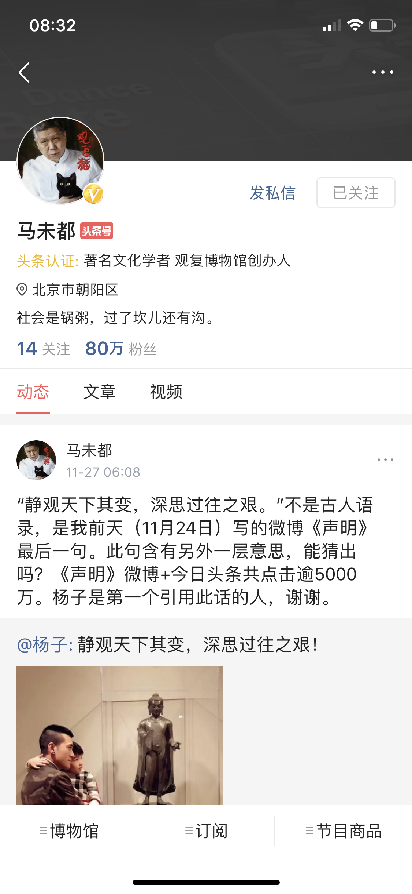
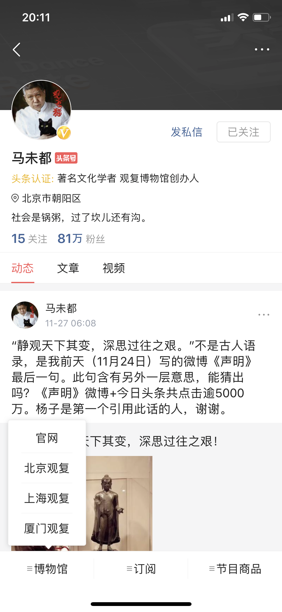

# 用户详情接口

## 用户详情接口

- 请求方式：GET

- 请求地址：/user/profile/homepage/v4/?

- 请求参数


| 参数     |  类型  | 是否必须 |   描述   |     示例     |
| ------- | -----  | ------ | -------- | ----------- |
| user_id |   Int  |   Y    | 用户的 ID | 53271122458 |
| device_id | Int  | Y    | 设备 ID | 8800803362  |
| iid       | Int  | Y    | 未知    | 14486549076 |


### 相关推荐视图


```
{
	"message": "success",
	"data": {
		"status": 0,
		"is_followed": false,
		"current_user_id": 0,
		"media_id": 1554769814257666,
		"description": "考研规划“神嘴”张雪峰老师。",
		"apply_auth_url": "sslocal://apply_user_auth_info",
		"bottom_tab": [],
		"article_limit_enable": 1,
		"verified_agency": "头条认证",
		"bg_img_url": "http://p3.pstatp.com/origin/bc30011684fa86d4b71",
		"verified_content": "知名教育博主 考研名师",
		"screen_name": "考研张雪峰",
		"is_following": true,
		"apply_auth_entry_title": "我的认证",
		"pgc_like_count": 0,
		"visit_count_recent": 439189,
		"star_chart": {},
		"user_verified": true,
		"top_tab": [{
			"url": "http://issub.snssdk.com/dongtai/list/v8",
			"is_default": true,
			"show_name": "动态",
			"type": "dongtai"
		}, {
			"url": "",
			"is_default": false,
			"show_name": "文章",
			"type": "all"
		}, {
			"url": "",
			"is_default": false,
			"show_name": "视频",
			"type": "video"
		}, {
			"url": "http://isub.snssdk.com/2/user/tab_wenda/",
			"is_default": false,
			"show_name": "问答",
			"type": "wenda"
		}],
		"user_auth_info": "{\"auth_type\": \"1\", \"auth_info\": \"知名教育博主 考研名师\"}",
		"is_blocking": 0,
		"is_blocked": 0,
		"user_id": 53271122458,
		"name": "考研张雪峰",
		"big_avatar_url": "http://p3.pstatp.com/large/1234001551c0974ce2ba",
		"area": null,
		"private_letter_permission": 1,
		"gender": 0,
		"industry": null,
		"creator_id": 53271122458,
		"share_url": "http://m.toutiao.com/profile/53271122458/?version_code=6.4.2&version_name=&device_platform=iphone",
		"show_private_letter": 1,
		"ugc_publish_media_id": 1576963425007630,
		"avatar_url": "http://p3.pstatp.com/medium/1234001551c0974ce2ba",
		"followers_count": 470837,
		"media_type": "2",
		"followings_count": 3,
		"medals": []
	}
}
```


```
{
	"message": "success",
	"data": {
		"status": 0,
		"is_followed": false,
		"current_user_id": 0,
		"media_id": 1553586690739201,
		"description": "每天分享最热音乐，关注全球音乐发展风向，探寻音乐的爱与感动！",
		"apply_auth_url": "sslocal://apply_user_auth_info",
		"bottom_tab": [],
		"article_limit_enable": 1,
		"verified_agency": "",
		"bg_img_url": "http://p3.pstatp.com/origin/bc30011684fa86d4b71",
		"verified_content": "",
		"screen_name": "音乐风向",
		"is_following": true,
		"apply_auth_entry_title": "申请认证",
		"pgc_like_count": 0,
		"visit_count_recent": 505,
		"star_chart": {},
		"user_verified": false,
		"top_tab": [{
			"url": "http://issub.snssdk.com/dongtai/list/v8",
			"is_default": true,
			"show_name": "动态",
			"type": "dongtai"
		}, {
			"url": "",
			"is_default": false,
			"show_name": "文章",
			"type": "all"
		}, {
			"url": "",
			"is_default": false,
			"show_name": "视频",
			"type": "video"
		}],
		"user_auth_info": "",
		"is_blocking": 0,
		"is_blocked": 0,
		"user_id": 52857648739,
		"name": "音乐风向",
		"big_avatar_url": "http://p3.pstatp.com/large/1234000b95a37b47e8b3",
		"area": null,
		"private_letter_permission": 0,
		"gender": 0,
		"industry": null,
		"creator_id": 52857648739,
		"share_url": "http://m.toutiao.com/profile/52857648739/?version_code=6.4.2&version_name=&device_platform=iphone",
		"show_private_letter": 1,
		"ugc_publish_media_id": 0,
		"avatar_url": "http://p3.pstatp.com/medium/1234000b95a37b47e8b3",
		"followers_count": 38014,
		"media_type": "2",
		"followings_count": 25,
		"medals": []
	}
}
```





```
{
	"message": "success",
	"data": {
		"status": 0,
		"is_followed": false,
		"current_user_id": 0,
		"media_id": 51025535398,
		"description": "社会是锅粥，过了坎儿还有沟。",
		"apply_auth_url": "sslocal://apply_user_auth_info",
		"bottom_tab": [{
			"type": "",
			"children": [{
				"schema_href": "sslocal://webview?url=http%3A%2F%2Fwww.guanfumuseum.org.cn%2F",
				"type": "href",
				"name": "官网",
				"value": "http://www.guanfumuseum.org.cn/"
			}],
			"value": "",
			"name": "博物馆"
		}, {
			"schema_href": "sslocal://webview?url=https%3A%2F%2Fguanfumuseum.tmall.com%2F",
			"type": "href",
			"children": [{
				"schema_href": "sslocal://webview?url=http%3A%2F%2Fxt.guanfu.com.cn%2Fexplore%2Fksjls_h5_slide1.php%3Fu%3D1000%26c%3D101120",
				"type": "href",
				"name": "《凯叔讲历史》",
				"value": "http://xt.guanfu.com.cn/explore/ksjls_h5_slide1.php?u=1000&c=101120"
			}],
			"value": "",
			"name": "订阅"
		}, {
			"type": "",
			"children": [{
				"schema_href": "sslocal://webview?url=http%3A%2F%2Fi.youku.com%2Fu%2FUMzI3ODg4MTI2OA%3D%3D",
				"type": "href",
				"name": "观复嘟嘟",
				"value": "http://i.youku.com/u/UMzI3ODg4MTI2OA=="
			}],
			"value": "",
			"name": "节目商品"
		}],
		"article_limit_enable": 1,
		"verified_agency": "头条认证",
		"bg_img_url": "http://p3.pstatp.com/origin/bc30011684fa86d4b71",
		"verified_content": "著名文化学者 观复博物馆创办人",
		"screen_name": "马未都",
		"is_following": true,
		"apply_auth_entry_title": "我的认证",
		"pgc_like_count": 0,
		"visit_count_recent": 1126382,
		"star_chart": {},
		"user_verified": true,
		"top_tab": [{
			"url": "http://issub.snssdk.com/dongtai/list/v8",
			"is_default": true,
			"show_name": "动态",
			"type": "dongtai"
		}, {
			"url": "",
			"is_default": false,
			"show_name": "文章",
			"type": "all"
		}, {
			"url": "",
			"is_default": false,
			"show_name": "视频",
			"type": "video"
		}],
		"user_auth_info": "{\"auth_type\": \"1\", \"auth_info\": \"著名文化学者 观复博物馆创办人\"}",
		"is_blocking": 0,
		"is_blocked": 0,
		"user_id": 51025535398,
		"name": "马未都",
		"big_avatar_url": "http://p9.pstatp.com/large/2c5e0004a6385965f1b6",
		"area": "北京市朝阳区",
		"private_letter_permission": 1,
		"gender": 0,
		"industry": null,
		"creator_id": 51025535398,
		"share_url": "http://m.toutiao.com/profile/51025535398/?version_code=6.4.2&version_name=&device_platform=iphone",
		"show_private_letter": 1,
		"ugc_publish_media_id": 1561724231755777,
		"avatar_url": "http://p9.pstatp.com/medium/2c5e0004a6385965f1b6",
		"followers_count": 805912,
		"media_type": "2",
		"followings_count": 14,
		"medals": []
	}
}
```

## 关注用户（取消关注）

- 请求方式：GET
- 请求地址：/2/relation/unfollow/?
- 请求参数

| 参数     |  类型  | 是否必须 |   描述   |     示例     |
| ------- | -----  | ------ | -------- | ----------- |
| user_id |   Int  |   Y    | 用户的 ID | 53271122458 |
| iid |   Int  |   N    | 用户的 ID | 18145386087 |
| app_name |   Int  |   N    | app 名称 | news_article |
| version_code |   String  |   N    | 版本号 | 6.4.2 |
| device_id       | Int    |  N   | 设备 ID   | 8800803362 |

```
{
    "message":"success",
    "data":{
        "user":{
            "is_followed":false,
            "media_id":1554769814257666,
            "create_time":1482744040,
            "is_following":false,
            "user_verified":true,
            "name":"考研张雪峰",
            "user_id":53271122458,
            "screen_name":"考研张雪峰",
            "last_update":"考研规划“神嘴”张雪峰老师。",
            "avatar_url":"http://p3.pstatp.com/thumb/1234001551c0974ce2ba",
            "user_auth_info":"{"auth_type": "1", "auth_info": "知名教育博主 考研名师"}",
            "type":1
        },
        "created":true
    }
}
```

## 取消关注用户每天上限

**不能无限次取消关注用户，每天上限是 30 次**

```
{
    "data":{
        "error_code":9,
        "name":"can unfollow no more than 30 times per day, now is 30",
        "description":"今日取消关注数量已达上限, 请明天再试"
    },
    "message":"error"
}
```


## 关注用户（点击关注按钮）

- 请求方式：GET
- 请求地址：/2/relation/follow/v2/?
- 请求参数

| 参数     |  类型  | 是否必须 |   描述   |     示例     |
| ------- | -----  | ------ | -------- | ----------- |
| user_id |   Int  |   Y    | 用户的 ID | 53271122458 |
| iid |   Int  |   Y    | 用户的 ID | 18145386087 |
| device_id | Int |  Y   | 设备 ID   | 8800803362 |


```
{
    "message":"success",
    "data":{
        "created":true,
        "description":"关注成功",
        "user":{
            "is_followed":false,
            "media_id":1554769814257666,
            "create_time":1482744040,
            "is_following":true,
            "user_verified":true,
            "name":"考研张雪峰",
            "user_id":53271122458,
            "screen_name":"考研张雪峰",
            "last_update":"考研规划“神嘴”张雪峰老师。",
            "avatar_url":"http://p3.pstatp.com/thumb/1234001551c0974ce2ba",
            "user_auth_info":"{"auth_type": "1", "auth_info": "知名教育博主 考研名师"}",
            "type":1
        }
    }
}
```

## 点击了关注按钮，就会出现相关推荐

- 请求方式：GET
- 请求地址：/user/relation/user_recommend/v1/supplement_recommends/?
- 请求参数

| 参数     |  类型  | 是否必须 |   描述   |     示例     |
| ------- | -----  | ------ | -------- | ----------- |
| follow_user_id |   Int  |   Y    | 用户的 ID | 53271122458 |
| iid |   Int  |   N    | 用户的 ID | 18145386087 |
| app_name |   Int  |   N    | app 名称 | news_article |
| device_platform |   Int  |   N    | 手机平台 | iphone |
| scene |   String  |   N    | 来源 | follow |
| source       | Int    |  N   | 来源   | follow |


```
{
    "has_more":0,
    "err_no":0,
    "user_cards":[
        {
            "stats_place_holder":"{"impr_id":"2017112908491701000805908912481"}",
            "recommend_reason":"papitube创始人 搞笑视频达人",
            "recommend_type":2048,
            "user":{
                "info":{
                    "user_id":5726188736,
                    "name":"papi酱",
                    "avatar_url":"http://p9.pstatp.com/thumb/9152/5124314802",
                    "desc":"你看！我是你们的光呀",
                    "schema":"sslocal://profile?uid=5726188736",
                    "user_auth_info":"{"auth_type": "1", "auth_info": "papitube创始人 搞笑视频达人"}"
                },
                "relation":{
                    "is_followed":0,
                    "is_following":0,
                    "is_friend":0
                }
            }
        },
        {
            "stats_place_holder":"{"impr_id":"2017112908491701000805908912481"}",
            "recommend_reason":"新车测评长期测试驾驶技术机械原理汽车文化交通安全等",
            "recommend_type":2048,
            "user":{
                "info":{
                    "user_id":51177075853,
                    "name":"38号车评中心",
                    "avatar_url":"http://p3.pstatp.com/thumb/ef500000b463966740a",
                    "desc":"新车测评长期测试驾驶技术机械原理汽车文化交通安全等",
                    "schema":"sslocal://profile?uid=51177075853",
                    "user_auth_info":""
                },
                "relation":{
                    "is_followed":0,
                    "is_following":0,
                    "is_friend":0
                }
            }
        }
    ]
}
```


