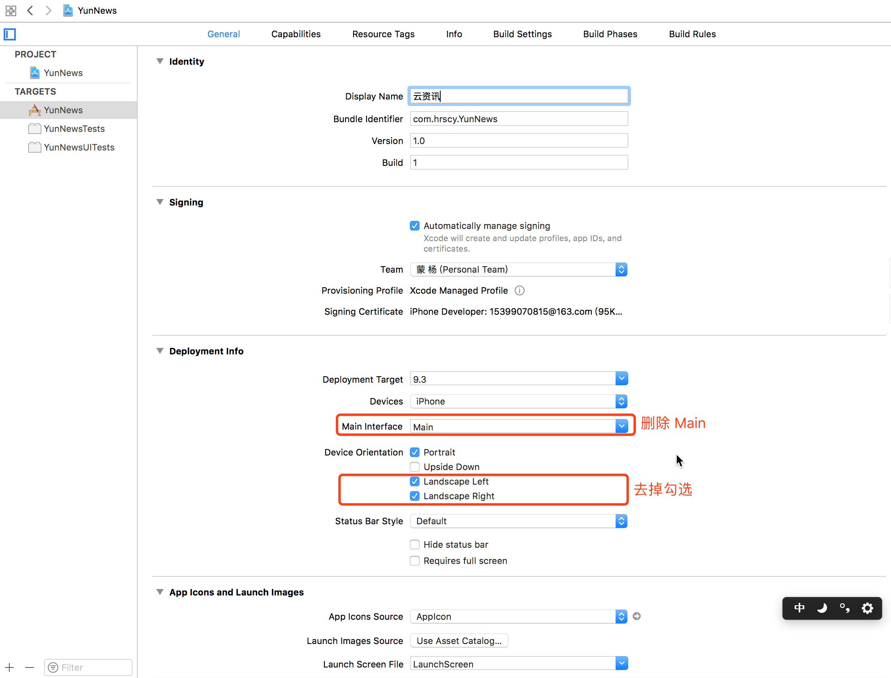
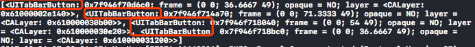
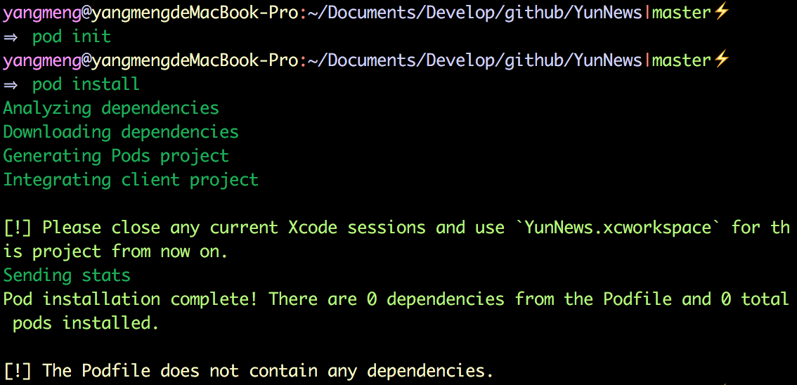
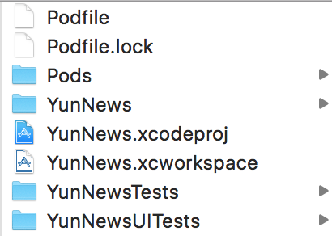

框架搭建
===

大家好，从本节课开始，我会一步一步地教大家把这个头条这个  app 实现出来。
今天的课程主要目的是搭建项目主框架。

## 1.新建项目
首先打开 xcode，我这里使用的 xcode 版本是8.3.3，点击新建一个 xcode 工程，然后选择 single view application ，输入项目名称，News，Team 一般是个人或者公司的开发者账号，这里我选择默认，然后输入组织名称，一般是公司或是组织的名称，我这边输入的 hrscy，下面是组织标识符，一般以 com 开头，后面带上公司或组织名称，我这里输入的是 com.hrscy,语言有两种，一种是 swift，另一种是 OC，这里我们选 swift，设备选 iphone 就可以了，其他都默认设置即可，然后点击下一步，选择想要保存的位置，我这边选择保存到桌面，

## 2.项目主框架一般有两种方式，一种是使用 storybaord 创建，另一种是使用代码创建
### 2.1.使用代码搭建基本框架，如下图设置



### 2.2 添加资源文件

### 2.3 自定义 `UITabBarController` 和 `UINavigationController`

## 3.创建四个控制器，首页，西瓜视频，小视频，我的


### 3.1 中间的加号按钮比较特殊
`UITabBarController`下方的工具条称为`UITabBar`，首先先来看一下 `tabbar` 的子视图都有什么：
```
// 系统view控件准备好之后调用这个方法 
- (void)viewDidAppear:(BOOL)animated { 
[super viewDidAppear:animated]; 
// 打印查看tabBar的所有子控件 NSLog(@"----%@", self.tabBar.subviews); 
}
```
如下图：


会发现四个名为 `UITabBarButton` 的类，如果`UITabBarController`有4个子控制器,那么`UITabBar`内部就会有4个`UITabBarButton`作为子控件与之对应。也就是说，`UITabBarButton`是`UITabBarController`中各个子控制器在工具条中对应的按钮的称呼，同时我们可以注意到一个现象,那就是我们创建好`UITabBarButton`之后,各个`UITabBarButton`在`UITabBar`中的位置是均分的，`UITabBar`的高度为49。`UITabBarButton` 是一个隐藏的子类，所谓隐藏是苹果没有在文档中明确提供却对视图的显示起着至关重要的作用，`UITabBarButton`⾥面显⽰什么内容，由对应子控制器的`tabBarItem`属性来决定。
下图就是`UITabBar`包含四个`UITabBarButton`和中间的`UIButton`


## 4.集成 cocoapods
我的 cocoapods 版本为 1.2.0.rc.1。
进入工程主目录，使用下面两个命令初始化并安装 cocoapods：
```
pod init

pod install
```
如下图：


安装完成后，会生成几个文件，分别是：
- Podfile：该文件可以放在任意一个目录下，需要做的是在Podfile中指定工程的路径，一般会放在工程的主目录，该文件主要用于管理安装依赖库，工程需要的依赖库都在这里添加。
- Podfile.lock：该文件用于保存已经安装的 Pods 依赖库的版本。
- Pods 文件夹：安装的依赖库源文件都在放在这个文件夹里。
- .xcworkspace 文件：该文件用来管理项目，它包含你创建的项目和cocoapods 的项目，以后不再打开 `.xcodeproj`文件，以后打开这个文件就相当打开最初创建的项目了。
  现在打开`xcworkspace`如下图：
  
## 5.项目架构用的比较多的有两种方式，一种是 MVC，一种 MVVM，这里使用比较传统的 MVC 设计模式。
## 6.建立文件夹，对项目进行模块划分


